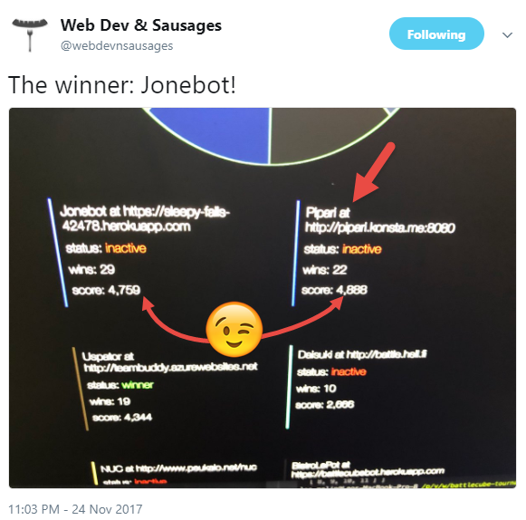
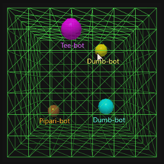

# The Pipari Bot (from Web Dev & Sausages Micro Christmas Hackathon 2017)

This is a bot created to fight in [Battle³](https://github.com/leomelin/battlecube) during [Web Dev & Sausages Micro Christmas Hackathon 2017](https://ssl.eventilla.com/event/x5y9E). 

Bot code was based on the [dumb-bot.js](https://github.com/leomelin/battlecube/blob/master/example_bots/dumb-bot.js) and improved in less than three hours on Nov 24th between 6pm and 9pm.

# Ranking in Final Battle

Pipari Bot made it cleary to the finals causing havoc in semi-finals and many times resulting in top position. In the final battle between ~8 bots it's final 2nd position was nice achievement especially when the winner was based on a bot that was mostly coded beforehand ;)

ref. [https://twitter.com/webdevnsausages/status/934165510069071872](https://twitter.com/webdevnsausages/status/934165510069071872)

# Game Example

Game between Pipari and example bots:

